# La Guajira wind, the full walkthrough (every figure, and what it means for the money)

This is the long version of the README. it goes through every figure the pipeline
produces, one by one, and for each one says three things: what it shows, how to
read it, and why it matters for the money. the README is the elevator pitch, this
is me actually walking you through the slides.

A quick word on the money side before we start, because it is the part that is
easiest to fudge. every other number in this repo comes out of the measured wind
data. the money numbers do not, they sit on top of cost and price assumptions, so
i pulled the few external anchors instead of guessing them and put them in one
place (`src/economics.py`). all dated June 2026:

* FX about 3,600 COP/USD
* wholesale / contract power about 250 to 300 COP/kWh (XM bolsa), call it
  ~$0.076/kWh
* retail residential tariff about 841 COP/kWh (GlobalPetrolPrices / CREG), about
  $0.234/kWh
* utility onshore wind about $1,041/kW and LCOE $0.034/kWh (IRENA 2024)
* small / distributed wind capex $1,990 to $6,971/kW, opex $39/kW/yr (NREL 2024)

Two prices, not one, and that distinction runs through the whole money story:
**a utility turbine sells into the grid at the wholesale price, a small turbine
on someone's roof offsets the retail tariff they would otherwise pay.** the retail
price is about 3x the wholesale price, and that single fact is why small wind can
make sense at all.

Everything below uses the **net** energy (after losses), so the money is on the
same basis as the engineering.

---

## Part 1, the wind resource

Before any turbine, what is the wind actually doing. these figures decide whether
the site is worth a project at all, which is the biggest money decision of the
lot, you can optimise a bad site forever and it stays a bad site.

### weibull_fit.png, the wind speed distribution

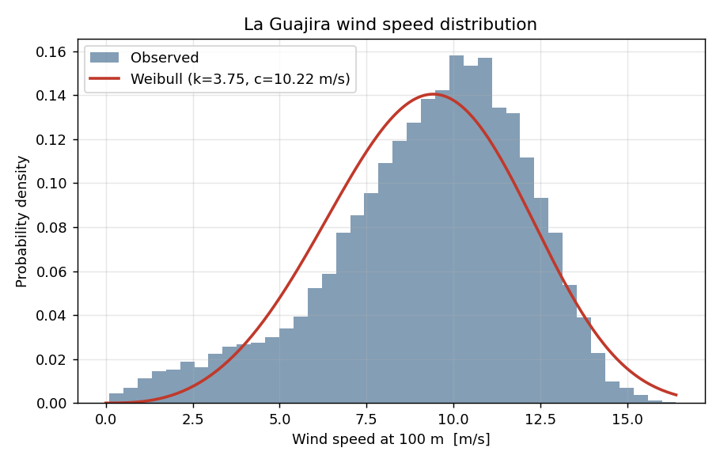

The histogram is three years of hourly wind at 100 m, the red line is a Weibull
fit (shape k = 3.75, scale c = 10.22 m/s). the mean is 9.26 m/s. for context most
onshore wind sites sit around 6 to 8 m/s, so this is already a top tier resource.
the high k means the distribution is narrow, the wind is not just strong but
*steady*, it spends most of its time in a tight band around 9 to 11 m/s rather
than swinging from calm to gale.

Being honest about the fit: the observed histogram is a touch more peaked than the
Weibull curve, there is a real spike around 10 to 11 m/s that the smooth curve
shaves off. the Weibull is a good summary, not a perfect one, which is why a real
study would test the goodness of fit (it is on the roadmap).

**Money:** energy goes with the cube of wind speed, so the difference between a
7 m/s site and a 9.3 m/s site is not 30% more energy, it is roughly
(9.3/7)^3 ≈ 2.3x more energy from the same turbine. that ratio is the whole
business case. the steadiness (high k) matters too, a steady wind means the
turbine runs near its sweet spot more of the time, which lifts the capacity factor
and therefore the revenue per dollar of turbine.

### patterns.png, the daily and yearly rhythm

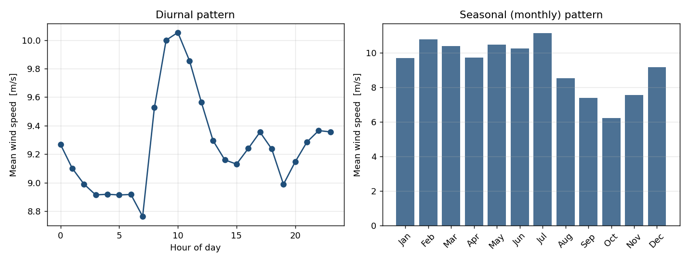

Left, the average wind by hour of day. it dips before dawn (around 8.9 m/s), then
climbs to a clear peak in the late morning, 9 to 11 h, near 10 m/s, and stays
healthy all afternoon and evening. (the README used to say it peaks at night,
that was wrong, the data says late morning, fixed.) right, the average by month,
windiest in the first half of the year with a peak around July, calmest in the low
season of September to November (October bottoms out near 6.2 m/s).

**Money:** the *timing* of generation is worth money, not just the total. two
points. first, the daytime peak lines up reasonably with daytime demand, which is
when power is usually worth more. second, and this is the big one for Colombia,
the windy season (roughly December to April plus midyear) overlaps the dry season
when the hydro reservoirs that dominate the Colombian grid are low and the
wholesale price spikes. wind here is basically counter seasonal to hydro, it
produces most when the grid is short and prices are high. i have not put a
seasonal price curve on this (i would need historical hourly prices), so i am
flagging it as a mechanism, not a number, but it is the single strongest argument
for building wind in La Guajira specifically.

### wind_rose.png and energy_rose.png, where it blows from

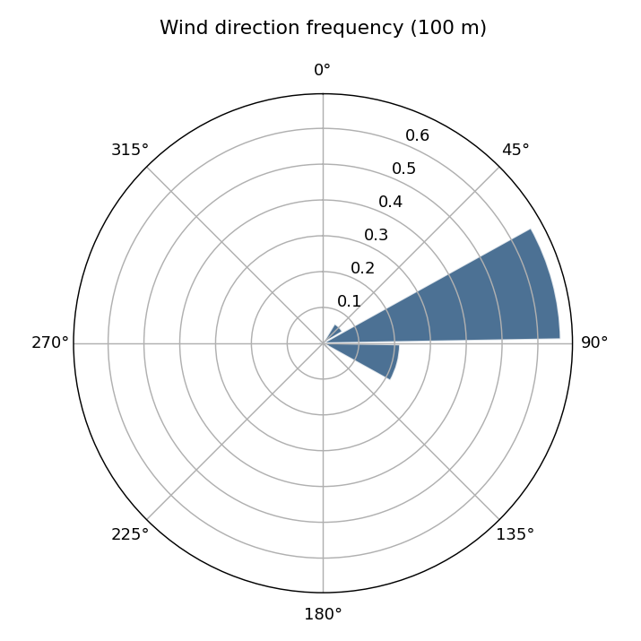
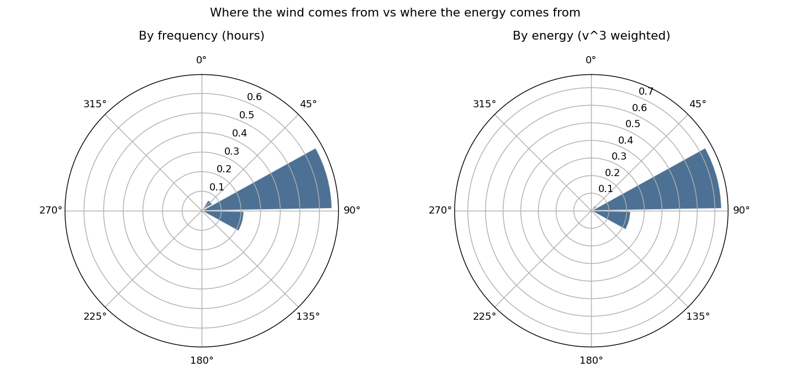

The rose is overwhelming, the wind comes from the east to east north east almost
all the time, one fat lobe around 60 to 90 degrees and almost nothing from
anywhere else. the energy rose (right panel of the second figure) weights each
direction by the cube of the speed instead of just counting hours, and it gets
even tighter on that sector, the strong winds come from the same place as the
frequent winds.

**Money:** this drives *layout*, which drives *cost and losses*. because the wind
is so directional you can line turbines up in rows perpendicular to the east west
flow and space them tightly along the rows, which means less land, less road, less
cable (cheaper) for the same number of turbines. it also means wake losses (one
turbine stealing wind from the one behind it) are predictable and avoidable with
good spacing in the one direction that matters. a site where the wind boxes the
compass is far harder and more expensive to lay out well. this figure does not
give a dollar number, it tells you *which* costs you can keep down.

### seasonal_weibull.png, how the distribution itself moves

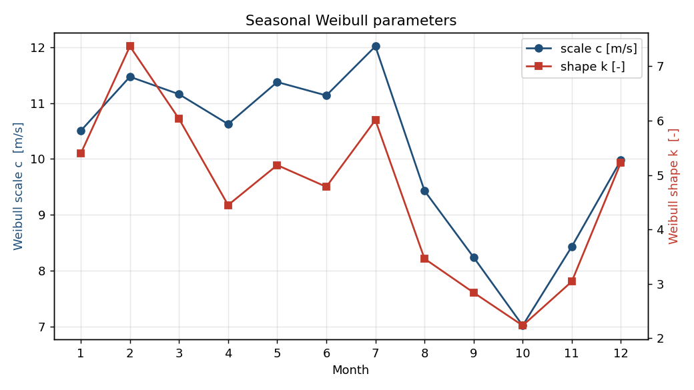

Instead of one Weibull for the whole record, this fits one per month. the scale c
(blue, how windy) and the shape k (red, how steady) both rise together in the
windy season and fall together in the low season, October is both the calmest and
the least steady month.

**Money:** this is the resource risk profile across the year. the windy months are
a double win, more wind *and* steadier wind, so the capacity factor in those
months is much better than the average suggests. the low season is the opposite. a
developer uses this to model monthly cash flow and, if there is any seasonal
shape to the power price, to check whether the good months line up with the
expensive months (here, they largely do).

### extreme_gust.png, the once in a lifetime wind

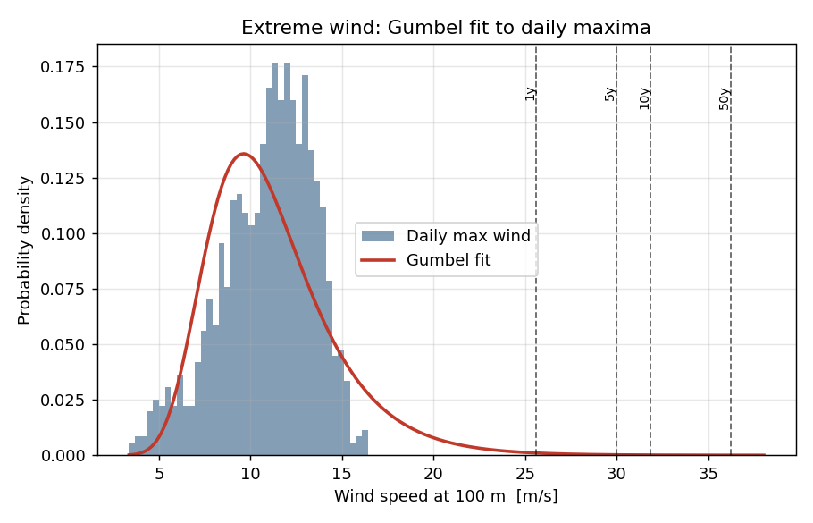

This is a different question from energy, it is survival. take the strongest hour
of each day, fit a Gumbel distribution to those daily maxima, and read off the
wind you would expect once every 1, 5, 10 and 50 years (the dashed lines). the
50 year return here is about 36 m/s.

**Money:** the extreme wind sets the *structural* design, how strong (and how
expensive) the turbine and foundation have to be to survive a once in 50 year
event. 36 m/s is moderate for such a windy site, the trades are relentless but
they are not stormy, so extreme gust loads are not the main cost driver here. the
bigger structural concern at a site like this is fatigue, the turbine runs hard
for a huge fraction of the year, so it is the accumulated cycles, not a single
storm, that wears it out. either way this figure is what an engineer turns into a
turbine class (IEC) selection, and the class you need is part of the turbine
price.

---

## Part 2, wind shear

### wind_shear.png, how fast the wind grows with height

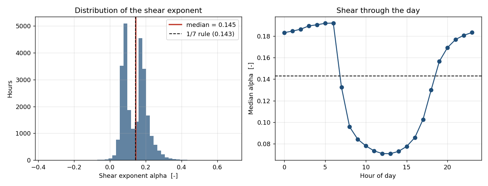

The dataset has wind at 10 m and at 100 m, so the shear is measured, not assumed.
left, the distribution of the power law exponent alpha fitted every hour, median
0.145, almost exactly the textbook 1/7 law (0.143). right, the same alpha by hour
of day, and it has a strong daily swing, high at night (0.18 to 0.19, the air near
the ground goes still while the wind aloft keeps blowing) and low at midday (about
0.07, the sun mixes the boundary layer so top and bottom move together).

**Money:** shear is literally the value of a taller tower. a higher alpha means
the wind grows faster as you go up, so every extra metre of tower buys more energy.
this number feeds straight into the tower payback figure later (econ_tower_payback).
it also has a measurement angle, if you only had a 10 m anemometer you would badly
understate the resource a turbine at 24 m or 100 m actually sees, so the shear is
what lets a cheap low measurement be corrected up to hub height honestly.

---

## Part 3, utility scale energy yield

Now we put generic multi MW turbines on the 100 m wind.

### turbine_compare.png, capacity factor versus total energy

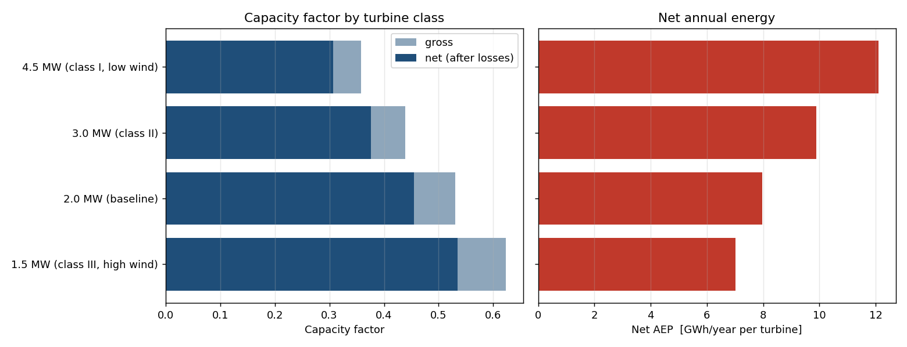

Four turbine classes on the same wind. left, capacity factor, gross (light) and
net after losses (dark). right, net annual energy. the pattern is the classic
trade off, the smaller rated machine (1.5 MW, a high wind class III design) posts
the best capacity factor (about 53% net) because its generator is small relative
to its rotor and it sits at full output more often, while the biggest machine
(4.5 MW) has the lowest capacity factor (about 31%) but makes by far the most total
energy (about 12 GWh/yr).

**Money:** capacity factor and total energy pull in opposite directions and they
cost money in different ways. high capacity factor means you use your grid
connection and your generator efficiently (good $/kW). high total energy means
more revenue per turbine, but you paid for a bigger machine to get it. which wins
depends on whether your binding constraint is the turbine cost or the land and
grid connection. the LCOE figure later resolves this for a fixed $/kW assumption,
and the answer (the high capacity factor machine) is a real and slightly counter
intuitive result for such a windy site.

### cf_heatmap.png, when the energy actually shows up

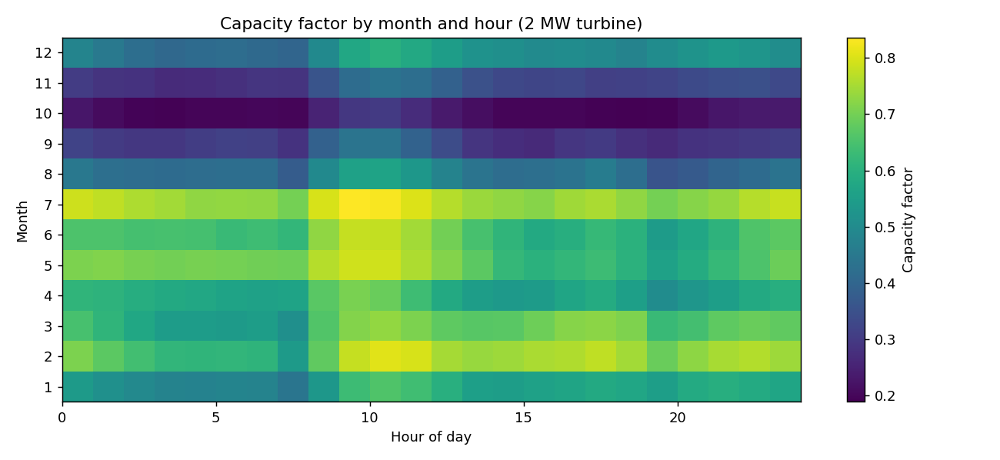

Capacity factor of the 2 MW machine broken out by month (vertical) and hour
(horizontal). bright is good. you can see both rhythms at once, the bright vertical
band in the late morning (the daily peak) and the bright horizontal block in the
windy first half of the year, with the dark stripe across September to November
(the low season).

**Money:** this is the generation profile a trader or an offtaker cares about. the
question is always, does the power show up when it is worth the most. here the
brightest cells are windy season mornings, and as noted that windy season is the
dry season when Colombian power prices tend to be highest. the dark low season is
the wet season when hydro is cheap and abundant, so producing less then costs you
less. the shape of this heatmap is, in plain terms, well matched to when the grid
will pay you well, which lifts the *value* of each MWh above what a flat price
assumption would suggest.

---

## Part 4, small wind turbines (the BEM blades)

This is where the repo shakes hands with my companion BEM solver, which designs
two small rotors (about 2.3 to 2.5 m radius, a few kW) and exports their power
coefficient Cp against tip speed ratio lambda. these get dropped onto the La
Guajira wind at a realistic 24 m hub (the 10 m wind pushed up with the measured
shear).

### swt_cp_curves.png, the blade aerodynamics

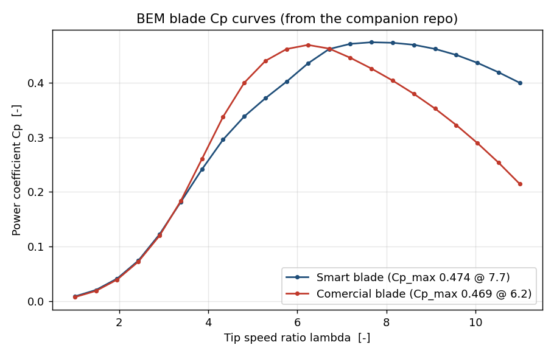

The two Cp curves straight from the BEM study. each blade has a single peak, the
smart blade tops out a touch higher (Cp about 0.474) and at a higher tip speed
ratio (about 7.7) than the comercial one (about 0.469 at 6.2). Cp is the fraction
of the wind's power the rotor captures, the theoretical ceiling (Betz) is 0.593,
so both blades are doing well.

**Money:** Cp is the rotor's quality, and it shows up linearly in every kWh, a 1%
better Cp is roughly 1% more energy and revenue for the same rotor and wind. but
notice it is a *small* lever compared to the resource, the difference between the
two blades is about 1% of Cp, while moving from a mediocre to a great site doubled
the energy back in Part 1. good blades matter, the site matters more.

### swt_power_curves.png, two control strategies from one curve

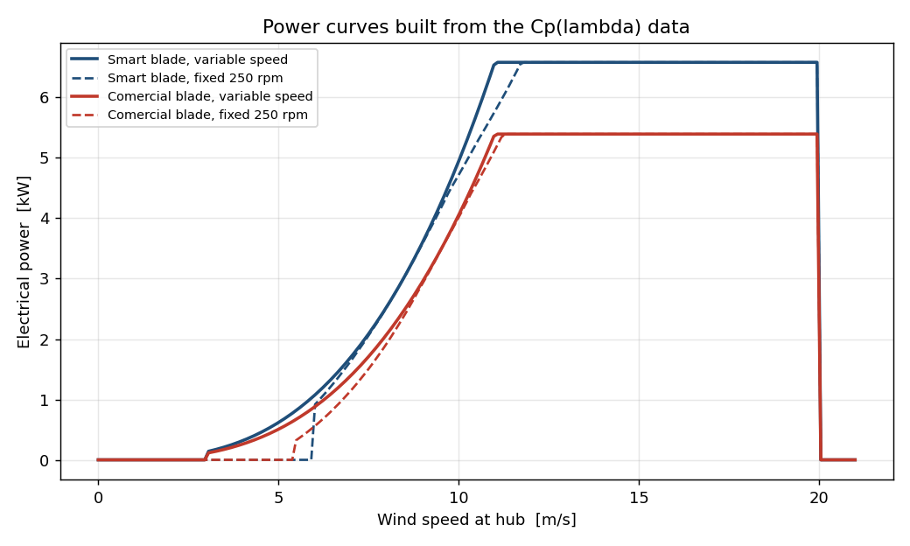

From each Cp curve i build two power curves. solid lines are variable speed (MPPT),
the rotor speeds up and slows down to keep lambda at the Cp peak across the whole
range, then the generator caps the power. dashed lines are fixed speed, the rotor
is stuck at one rpm so lambda drifts off the peak as the wind changes, and you can
see the dashed curves start late and lag, especially in light wind where a fixed
fast rotor is spinning way too fast for the breeze (lambda too high, Cp low).

**Money:** the gap between the solid and dashed lines is the value of the control
electronics. variable speed costs more (a power converter) but it harvests the
light winds that a fixed speed machine throws away, and on this site that is worth
about 7 to 8% of annual energy (next figure). that is the kind of number you weigh
against the cost of the converter to decide if it pays.

### swt_compare.png, the headline small wind result

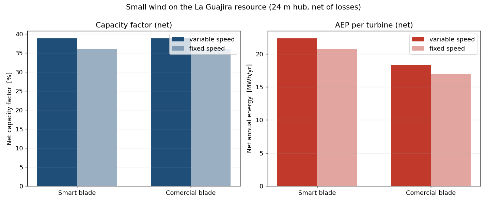

Net capacity factor and net annual energy for both blades and both strategies.
variable speed beats fixed speed by about 7 to 8% everywhere, and the smart blade
beats the comercial one on total energy (bigger rotor, slightly better Cp). both
blades land on the *same* capacity factor, about 39% net, which looks like a bug
but is not, with MPPT and the generator sized at a common rated wind, capacity
factor depends only on the wind distribution and the rated wind speed, not on the
blade, the blades part ways on absolute energy (AEP), not on CF.

**Money:** about 39% net capacity factor is excellent for small wind, which
usually sits well below utility scale. but i want to be honest, even that is
optimistic, real small turbines run lower because of turbulence near the ground,
short towers and rough siting, and the number looks this good partly because the
rated wind (11 m/s) is only 1.44x the mean hub wind (7.63 m/s), a low ratio that
pins the turbine near full output a lot. the smart blade making more total energy
is the bankable conclusion, more energy is more revenue, full stop, and it
confirms the BEM study's design call against a real resource.

### swt_energy_distribution.png, where the year's energy comes from

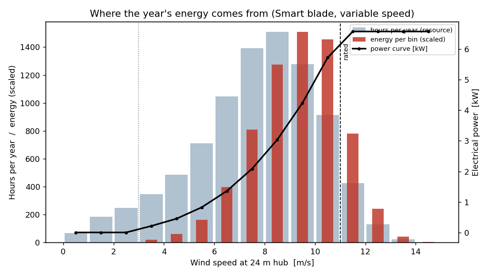

This folds the power curve (black line, right axis) onto the wind distribution at
hub height (pale bars, hours per year) and shows the resulting energy per wind
speed bin (red bars). the most common wind is about 8.5 m/s, but because energy
goes with the cube of speed, the average kWh actually arrives around 9.3 m/s, up
on the steep part of the curve just below rated. the light winds are common but
nearly worthless, the strong winds are valuable but rare, and the money is made in
the band in between.

**Money:** this tells you where to care about accuracy. the turbine should be
tuned to be reliable and efficient right in that 8 to 12 m/s band, that is where
the revenue lives. a percent of Cp lost down at 5 m/s barely matters, a percent
lost at 10 m/s is real cash. it also says cut in speed is almost irrelevant to the
money here (hardly any energy below 4 m/s) while the behaviour near rated is
everything.

### swt_hub_height.png, what a taller tower buys (energy)

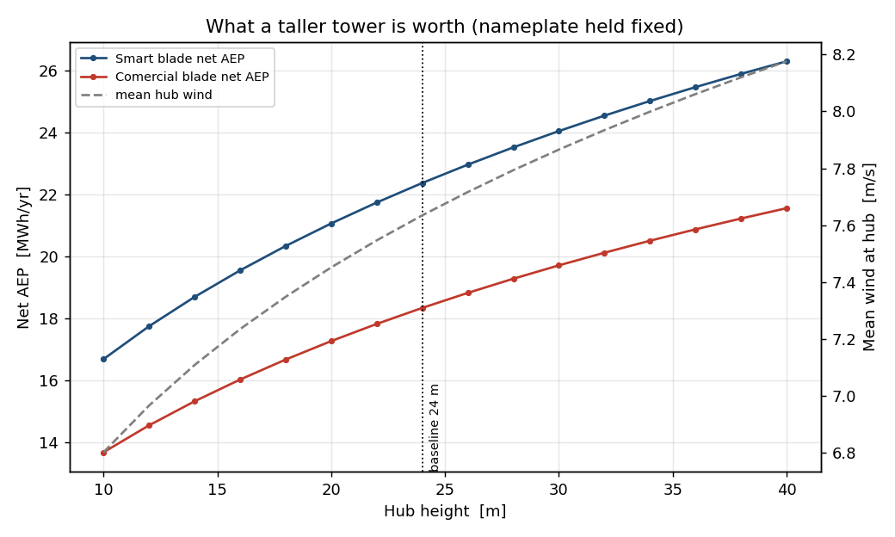

Sweep the hub height from 10 to 40 m, holding the generator nameplate fixed (the
tower does not change the generator), and recompute net AEP. both blades climb
steadily, the dashed grey line is the mean hub wind rising with height per the
measured shear. going from an 18 m to a 30 m tower lifts the smart blade energy by
about 18%.

**Money:** this is the energy half of a real purchasing decision, and the cost
half (more steel, a bigger crane, a deeper foundation) is the next figure. 18%
more energy every year for 20 years is a lot of cumulative revenue, the question
is only whether it beats the one off cost of the taller tower. note this is a
genuinely free lever in the sense that it does not need a better turbine, just a
taller pole, which is exactly why short towers are usually a false economy at a
high shear site.

### swt_specific_power.png, sizing the generator

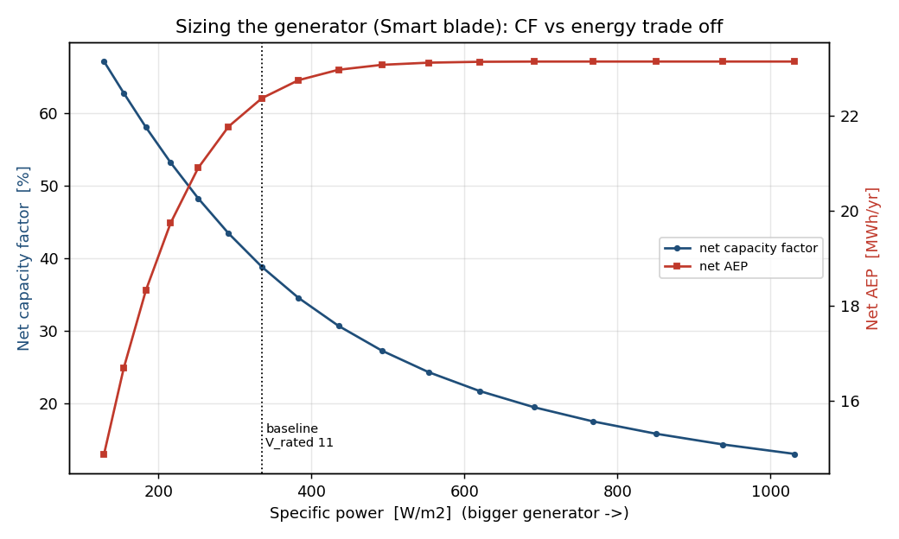

The blade is fixed but the generator behind it is a choice. sweep the rated wind
speed (which is the same as sweeping the specific power, rated watts per m2 of
rotor) and watch capacity factor (blue) trade against annual energy (red). a small
generator (low specific power) gives a gorgeous capacity factor but caps the
energy early, a big one chases the peaks but runs part loaded most of the time.
the baseline 335 W/m2 sits in the sensible middle, where the energy curve is just
starting to flatten but the capacity factor has not collapsed.

**Money:** this is the classic spec'ing trade off in one picture. capacity factor
is a proxy for how well you use the expensive bits (generator, converter, grid
connection), total energy is the revenue. you do not actually want to maximise
either one, you want to minimise cost per kWh, and that optimum is somewhere in
the middle of this curve. it depends on whether the generator or the rotor
dominates your cost, which is a real number a manufacturer would plug in here.

---

## Part 5, the economics (the heart of the money story)

Parts 1 to 4 were energy. this is where energy meets dollars. assumptions and
sources are in the file header of `src/economics.py`, June 2026.

### econ_lcoe.png, what it costs to make versus what it can earn

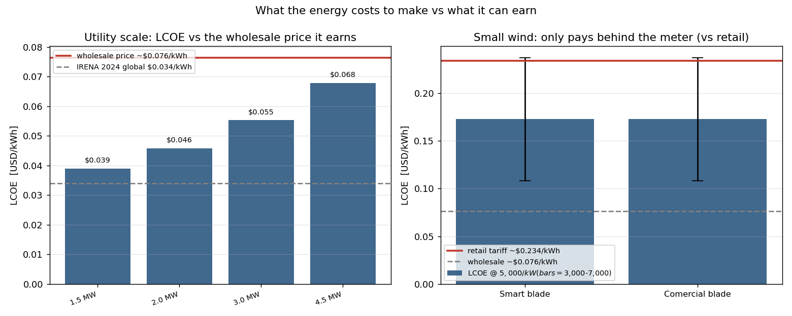

Levelised cost of energy (LCOE) is the price each kWh has to fetch, averaged over
the life, for the project to break even. it is just (annualised capex + annual
opex) / annual energy.

Left, the utility machines, valued against the wholesale price. all four classes
come in between about $0.039 and $0.068/kWh, *all of them below* the wholesale
price line (about $0.076/kWh), and in the same neighbourhood as the IEC... sorry,
the IRENA 2024 global benchmark (the grey dashed line, $0.034). the high capacity
factor 1.5 MW machine is the cheapest, because for a fixed $/kW the machine that
runs at the highest capacity factor spreads its capex over the most kWh (caveat,
real $/kW is not perfectly equal across classes, the bigger rotor per kW costs a
bit more).

Right, the small wind blades, valued against the retail tariff, with the bars
showing the full NREL capex range ($3,000 to $7,000/kW). the central LCOE is about
$0.17/kWh, which sits *above* the wholesale price but *below* the retail tariff
(about $0.234), and the error bar straddles the retail line.

**Money, and this is the punchline of the whole repo:**

* **Utility wind here is firmly bankable.** LCOE around $0.04 to $0.05/kWh against
  a wholesale price around $0.076 is a healthy margin, roughly $0.03/kWh, which on
  a 2 MW turbine making ~8 GWh/yr is on the order of $240,000 a year of gross
  margin per turbine. this is why La Guajira is the centre of Colombia's wind
  build out, the numbers just work.
* **Small wind only works behind the meter.** its LCOE (~$0.17) is more than twice
  the wholesale price, so as a grid seller it loses money, but it is below the
  retail tariff it can offset, so on someone's own roof or farm, where each kWh it
  makes is a kWh they do not have to buy at $0.234, it roughly pays. the
  conclusion holds across the whole capex range, cheap installs are clearly
  worth it and even pricey ones break about even, purely because this site's
  capacity factor is so high it drags the cost down to where the retail tariff can
  meet it.

That two prices distinction is the entire reason small wind is not simply a bad
idea here, it is a bad grid generator and a decent self supply.

### econ_tower_payback.png, does the taller tower pay

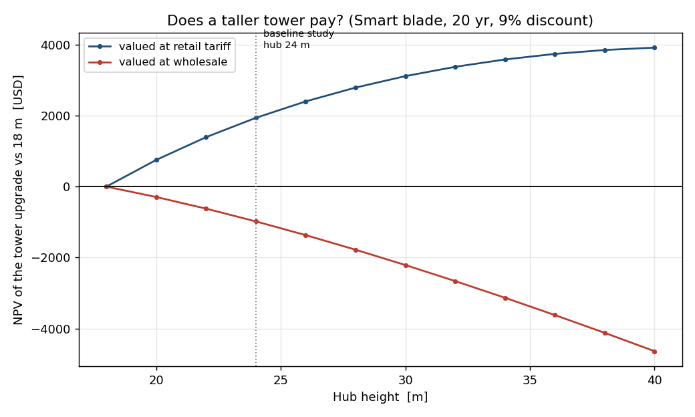

This puts a price on the hub height energy from Part 4. for the smart blade it
takes the extra net AEP of each taller tower (versus an 18 m baseline), values
that energy stream over 20 years (discounted at 9%), and subtracts the extra tower
cost (the softest assumption in the repo, about $400 per extra metre, flagged
loudly). the result is the net present value of the tower upgrade, drawn twice, at
the retail price (blue) and at the wholesale price (red).

The two lines split completely. valued at the retail tariff, a taller tower is
always worth it over this range, the NPV climbs to roughly +$3,900 by 40 m and
never looks back. valued at the wholesale price, it is never worth it, the curve
goes straight negative, the extra energy is too cheap to repay the steel.

**Money:** same physical tower, same extra energy, opposite decision, and the only
thing that changed is what the energy is worth. this is the cleanest illustration
in the repo of why the price you sell at, not just the wind, decides the
engineering. a homeowner offsetting retail should build the tallest tower they can
afford, a grid seller at wholesale should not bother. (and the answer is sensitive
to that $400/m guess, which is exactly why it is drawn as a decision curve and not
quoted as a single payback year.)

---

## Part 6, two data sources

### source_comparison.png, ERA5 versus NASA satellite

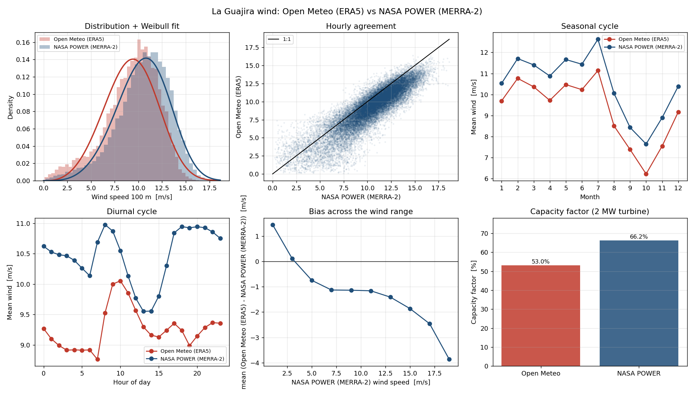

The whole analysis runs on Open Meteo (ERA5 reanalysis), but i also pull the same
site from NASA POWER (MERRA-2, built from satellite observations) and compare them
six ways. they correlate well (0.88) and share the same daily and seasonal shapes,
but NASA reads about 1.2 m/s windier on average, and that gap widens at high wind
speeds. pushed through the power curve it swings the estimated capacity factor from
about 53% (ERA5) to about 66% (MERRA-2), and the annual energy by roughly 2,300
MWh per 2 MW turbine.

**Money:** this is the uncertainty that keeps developers up at night. 2,300 MWh a
year, valued at the wholesale price, is about $175,000 a year of revenue per
turbine that exists or does not depending purely on which free dataset you chose
to believe. over a project life and a whole wind farm that is a number with a lot
of zeros. it is the direct, quantified argument for spending real money on an on
site measurement mast before financing anything, the cost of a met mast is trivial
next to the cost of being wrong about the resource by 13 capacity factor points.
the reassuring half is that the *shapes* agree, so the qualitative story (windy
mornings, windy dry season, ENE direction) is robust, it is only the absolute
level that is in question.

---

## Part 7, forecasting

A from scratch ridge regression (NumPy only, closed form) predicts the wind power
a few hours ahead, trained on 2021 to 2022 and tested on 2023. money first, this
is the weakest money story in the repo and i would rather say so than dress it up,
the mechanism is real (better forecasts cut imbalance penalties in the day ahead
and intraday markets) but i do not have the market settlement rules to put a
number on it, so treat this part as the predictability characterisation, not a
revenue line.

### skill_vs_horizon.png, when the model beats just guessing persistence

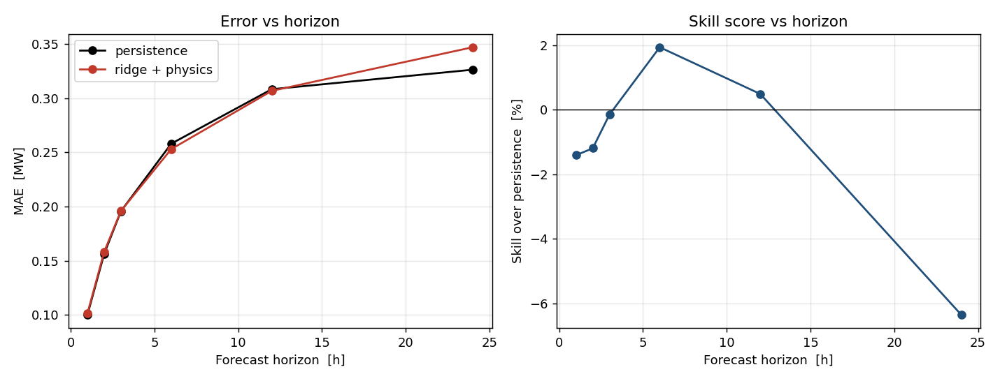

Left, mean error versus how far ahead you forecast, for the model and for the dumb
baseline (persistence, assume the next value equals the last one). right, the skill
score, how much better than persistence in percent. the model only wins in a narrow
window, it peaks at about +2% at 6 hours ahead, is basically tied or slightly worse
at 1 to 3 hours (the wind just does not change much that fast, so persistence is
almost unbeatable), and is clearly worse by 24 hours.

**Money:** the value of a forecast is highest where you can actually beat the naive
guess and where the market penalises errors, here that is the 6 to 12 hour window.
the honest read is that the edge is small (a couple of percent), this wind is
steady and therefore fairly predictable by persistence alone, so a fancy model
buys you a little, not a lot. that is itself useful to know before paying for a
sophisticated forecasting service.

### forecast_timeseries.png, the forecast in action

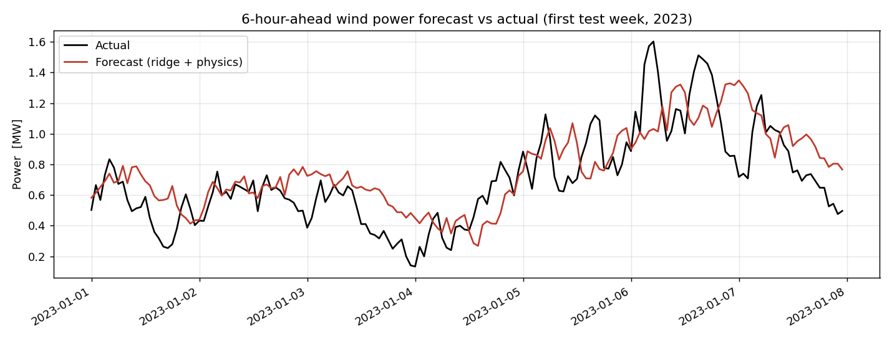

One test week, actual power in black, the 6 hour ahead forecast in red. it tracks
the broad rises and falls well but it lags and undershoots the sharp ramps, the
fast climbs and drops.

**Money:** the ramps it misses are exactly the expensive moments, a big fast change
in output is what causes an imbalance you have to pay to settle. so the errors are
not spread evenly in value, they cluster on the costly events, which the next
figure makes explicit.

### error_by_regime.png, where the error lives

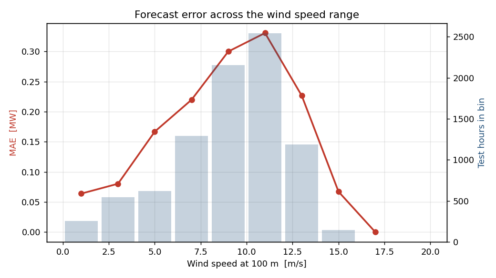

Forecast error (red line) against wind speed, with the pale bars showing how many
test hours fall in each speed bin. the error is small in light and in strong wind
and peaks hard around 11 m/s, right on the steep part of the power curve near
rated.

**Money:** this is the same lesson as the small wind energy distribution but for
forecasting, the steep part of the power curve is where a small wind error turns
into a big power (and big money) error. above rated the turbine is pinned at full
output so it is trivial to predict, below cut in it makes nothing, all the
forecasting value and risk is concentrated in that middle band, which is also
where most of the energy and revenue sits. if you were going to spend effort
improving the forecast, you would spend it there.

### feature_importance.png and actual_vs_pred.png, model internals

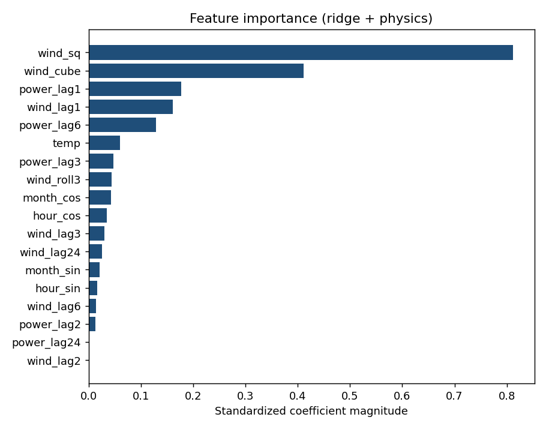
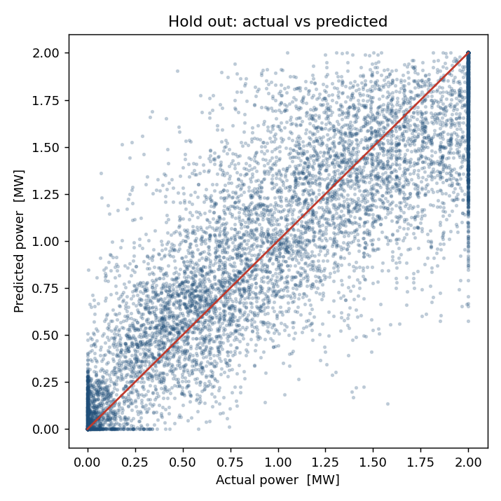

Feature importance, the two biggest coefficients are the physics features, wind
squared and wind cubed, followed by the recent lags of power and wind. the model
basically rediscovered that power goes with the cube of wind speed, which is
reassuring. the scatter is predicted versus actual on the hold out, a cloud around
the 1:1 line, decent but with real spread.

**Money:** these two are honestly indirect on the money. their value is confidence
and diagnosis, the physics features dominating tells me the model is learning the
right thing and not overfitting some spurious lag, and the scatter shows the
residual risk that remains after forecasting. no dollar figure, and i would rather
say that than invent one.

### alpha_sweep.png, does tuning help

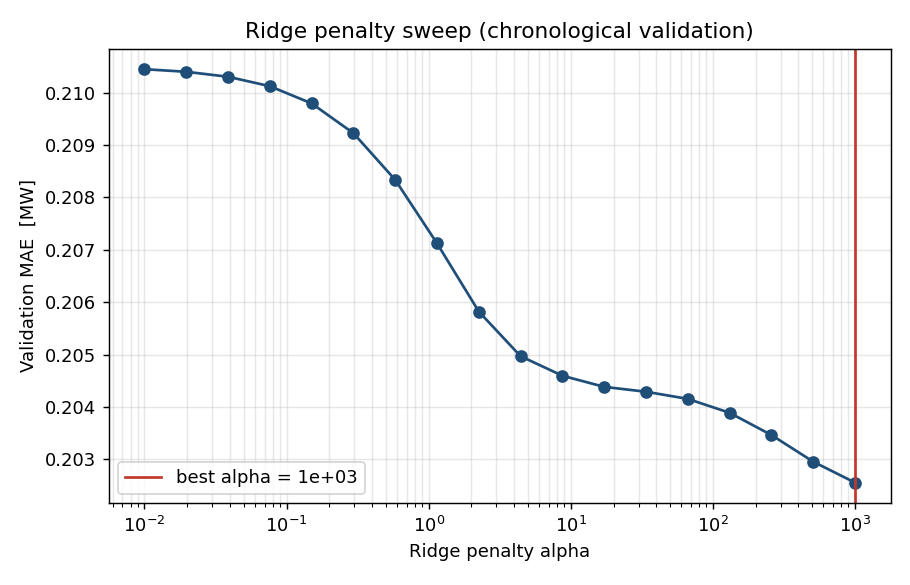

The ridge penalty swept across orders of magnitude on a separate validation slice.
the validation error barely moves, from about 0.2105 to 0.2025 MW across the whole
range, a few percent.

**Money:** the flatness is the message, and the message is *do not bother*. this
problem is not limited by overfitting or by tuning, it is limited by how
predictable the wind fundamentally is. that saves you from spending money and time
chasing model tweaks that the data will never reward. knowing where the ceiling is
is worth something even when it is bad news.

---

## What i would not claim

To keep myself honest:

* the cost and price anchors are real and sourced, but they are point estimates on
  a volatile market (the Colombian wholesale price swung 80% in a single month in
  early 2026), so every money number is a central case, not a promise. that is why
  the two figures that matter most (LCOE and tower payback) are drawn as ranges
  and as decision curves, not single bars.
* i value energy at a flat price. the real prize (wind being most valuable in the
  dry season and during daytime) needs hourly historical prices to quantify, i can
  only point at the mechanism.
* the tower cost per metre is a guess, hence the two price decision curve rather
  than a quoted payback.
* the whole resource sits on reanalysis, and the two reanalyses disagree by 13
  capacity factor points. nothing here replaces an on site met mast, it sizes the
  prize and tells you it is worth measuring properly.

The thing i am confident about, because it survives every assumption range i
tried, is the shape of the conclusion: utility wind at La Guajira is firmly
economic at today's wholesale prices, and small wind is a behind the meter play
that this exceptional site drags up to about break even against the retail tariff,
where at an average site it would not come close.
